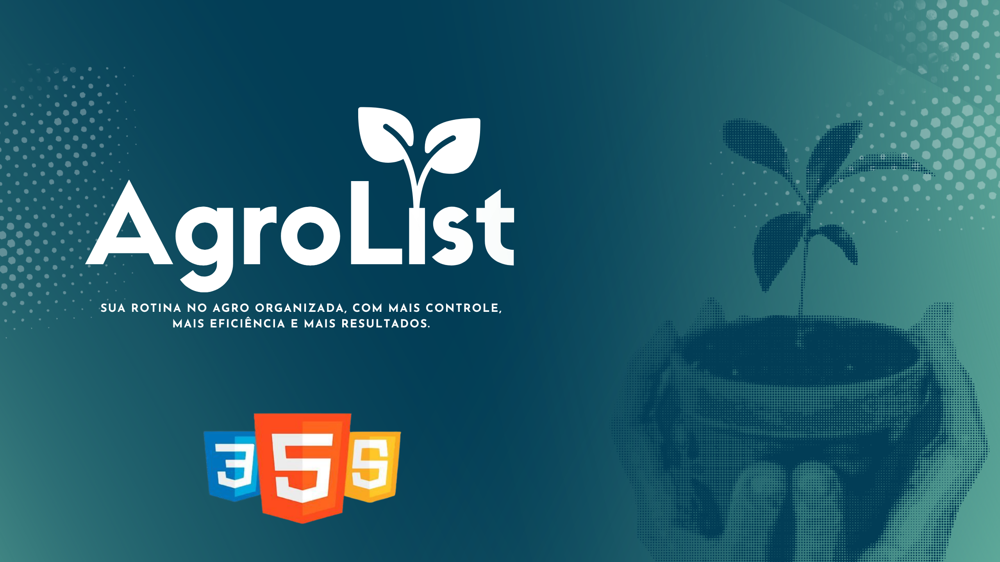

<div align="center">



# AgroList
### 🌱 Desafio front-end
</div>

---

## 🎯 Visão Geral

```+
! O AgroList surgiu a partir de uma proposta de desafio para criar uma to-do list, onde as principais stacks seriam: JavaScript, CSS e HTML.
! Por que AgroList? Agro vem de agronegócio e List vem de to-do list.
```
```+
! No AgroList, você pode adicionar tarefas, marcá-las como concluídas e também excluí-las.
! Para deixar sua rotina no Agro mais organizada e eficiente.

```


## 🤝 Autoria e Créditos

<div align="center">

Este projeto foi desenvolvido com dedicação por:

**Érica Bonfanti Corrêa**
[GitHub](https://github.com/EricaBonfanti) | [LinkedIn](https://www.linkedin.com/in/ericabonfanti/)

---

</div>
